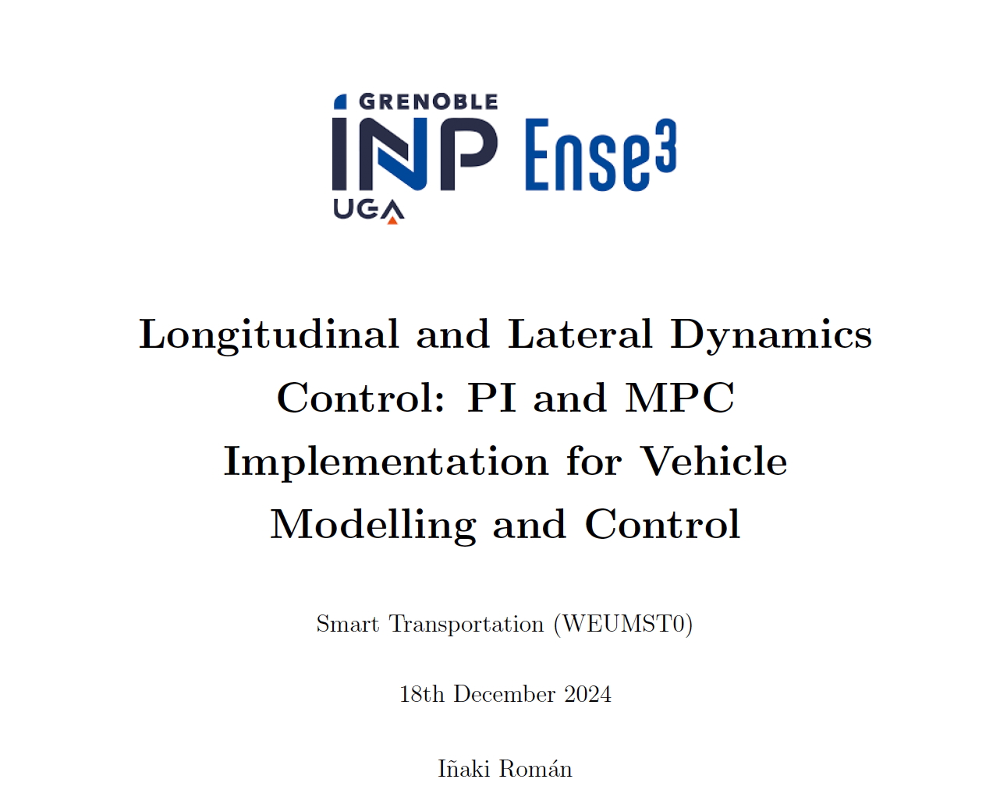

# Longitudinal and Lateral Dynamics Control: PI and MPC Implementation for Vehicle Modeling and Control

This project presents the **modeling, simulation, and control** of a vehicle’s longitudinal and lateral dynamics using **Proportional-Integral (PI)** and **Model Predictive Control (MPC)** techniques. The vehicle model is based on the **Renault Mégane**, and the control systems are tested under various scenarios, including simulations on the **Montmelo racetrack**.

## Author
- Iñaki Román

## Date
- 18th December 2024

## Table of Contents
- [Introduction](#introduction)
- [Methodology](#methodology)
  - [Vehicle Dynamics Modeling](#vehicle-dynamics-modeling)
  - [Control Systems](#control-systems)
- [Simulations](#simulations)
  - [Longitudinal Control](#longitudinal-control)
  - [Lateral Control](#lateral-control)
  - [Montmelo Racetrack Simulation](#montmelo-racetrack-simulation)
- [Conclusions](#conclusions)
- [Vehicle Parameters](#vehicle-parameters)
- [Road Conditions](#road-conditions)
- [Requirements](#requirements)
- [How to Run](#how-to-run)

## Introduction

This project focuses on the **longitudinal and lateral dynamics** of a vehicle and the design of control systems for speed regulation and yaw rate tracking. The **longitudinal dynamics** are controlled using a **PI controller** with anti-windup and feedforward mechanisms, while the **lateral dynamics** use **Model Predictive Control (MPC)** to track a yaw rate reference.

The simulation environment is developed in **MATLAB/Simulink**, incorporating both linear and non-linear vehicle models and tested under various road conditions and terrains.

## Methodology

### Vehicle Dynamics Modeling

1. **Bicycle Model**: A simplified model representing the vehicle's dynamics with front and rear axles, capturing essential behaviors for lateral and longitudinal forces.
2. **Longitudinal Dynamics**:
   - Linear and non-linear force models, including drag forces, slip ratios, and tire-road interactions.
3. **Lateral Dynamics**:
   - Incorporates yaw rate, side-slip angle, and steering dynamics using tire force models (Pacejka equations).

### Control Systems

1. **Longitudinal Control**:
   - **PI Controller** with anti-windup and saturation limits to regulate longitudinal speed.
2. **Lateral Control**:
   - **MPC Controller** designed using MATLAB's MPC Toolbox for yaw rate tracking.

## Simulations

### Longitudinal Control

- **Linear and Non-Linear Models** tested under varying conditions.
- PI Controller performance evaluated with different velocity references and terrain frictions.

### Lateral Control

- Lateral dynamics modeled and simulated with and without control.
- MPC ensures yaw rate tracking while respecting steering constraints.

### Montmelo Racetrack Simulation

- Integration of **longitudinal PI** and **lateral MPC** controllers.
- Pure Pursuit Algorithm implemented for trajectory tracking.
- Due to algebraic loop issues, only partial simulation with fixed yaw and speed references was completed.

## Conclusions

- **PI control** effectively manages longitudinal speed with non-linearities like drag and slip.
- **MPC** ensures stable yaw rate tracking in lateral dynamics.
- Integration challenges (algebraic loops) in full vehicle simulation highlight the need for robust integration and tuning strategies.

## Vehicle Parameters

| Parameter                | Value    |
|--------------------------|----------|
| Mass (m)                 | 1400 kg  |
| Moment of inertia (Iz)   | 1960 kg·m² |
| Distance to front axle (lf) | 1.177 m |
| Distance to rear axle (lr)  | 1.358 m |
| Drag coefficient (Cd)    | 0.35     |
| Frontal area (Af)        | 2.14 m²  |
| Rolling resistance (Cr)  | 0.015    |
| Wheel radius (R)         | 0.3 m    |
| Longitudinal stiffness (Cλ) | 66100 N/rad |
| Front lateral stiffness (Cαf) | 84085 N/rad |
| Rear lateral stiffness (Cαr) | 87342 N/rad |

## Road Conditions

| Surface Type   | µ1   | µ2    | µ3   |
|----------------|------|-------|------|
| Dry (Asphalt)  | 1.11 | 23.99 | 0.52 |
| Wet (Asphalt)  | 0.687| 33.822| 0.347|
| Cobblestone    | 1.37 | 6.46  | 0.67 |
| Ice            | 0.19 | 94.13 | 0.06 |

## Requirements

- MATLAB with Simulink
- Model Predictive Control Toolbox
